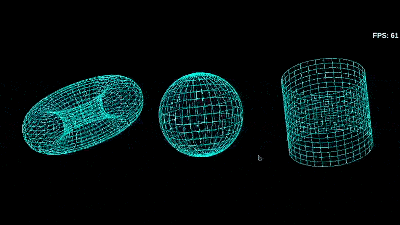

# GUB.js
<!--  -->


GUB.js is a lightweight JavaScript game engine designed to simplify the development of browser-based games by providing essential features like a game loop, graphics engine, and utilities for managing game context and rendering.

## Table of Contents

- [Overview](#overview)
- [Project Structure](#project-structure)
- [Installation](#installation)
- [Usage](#usage)
- [Core Modules](#core-modules)
- [License](#license)

## Overview

GUB.js serves as the foundation for game development by providing utilities and components such as:

- A graphics engine for rendering graphics.
- A game loop for continuous game updates.
- Context management for handling game state.

## Project Structure

```
.
├── index.html
├── js
│   ├── core
│   │   ├── event_manager.js
│   │   ├── game_engine.js
│   │   └── graphic_engine.js
│   ├── gameloop.js
│   └── utils
│       ├── geometry.js
│       └── init_engine.js
├── README.md
└── run.sh
```

## Installation

To use GUB.js, you need to run it on a local server to avoid CORS restrictions. You can easily set up a simple HTTP server with Python:

```bash
python3 -m http.server 8000
```

Alternatively, you can use the provided `run.sh` script to start the server.

## Usage

To create a simple game using GUB.js, follow the example below. This example includes an HTML file that sets up the viewport for rendering and initializes the game engine.

### Example HTML Structure

Create an `index.html` file with the following content:

```html
<!DOCTYPE html>
<html lang="en">
  <head>
    <meta charset="UTF-8" />
    <meta name="viewport" content="width=device-width, initial-scale=1.0" />
    <title>Graphic Engine</title>
    <style>
      body {
        display: flex;
        width: 100vw;
        height: 100vh;
        justify-content: center;
        align-items: center;
      }

      .viewport-container {
        display: flex;
        width: 75%;
        height: 75%;
        position: relative;
        border: 1px solid black;
      }
    </style>
  </head>
  <body>
    <div id="game-viewport" class="viewport-container"></div>
    <script type="module" src="./js/utils/init_engine.js"></script>
  </body>
</html>
```

### Game Loop Implementation

In the `gameloop.js` file, you can define the `gameLoop` function, which serves as the central hub for your game's logic and rendering updates. This function is called continuously by the game engine, allowing you to manage game state, update animations, and handle input.

Here's a basic implementation that renders a simple red grid:

```javascript
export const gameLoop = ({ graphics }) => {
  // Loop through a 200x200 grid to set pixel colors
  for (let y = 0; y < 200; ++y) {
    for (let x = 0; x < 200; ++x) {
      graphics.putPixel(x, y, 0xff0000); // Set the pixel at (x, y) to red
    }
  }

  // Additional game logic can be added here
  // e.g., updating and rendering game objects
};
```

### Explanation

- **Function Purpose**: The `gameLoop` function is where you can implement your game's core logic, such as rendering graphics, updating object positions, and responding to user inputs.
- **Extensibility**: You can expand this function by adding more game logic, such as updating the positions of sprites, handling user input, or checking for collisions, ensuring your game reacts dynamically to events.

This structured approach allows you to build a responsive and interactive game environment efficiently.

## Core Modules

### GameEngine Class

The `GameEngine` class serves as the foundation for game development, providing essential utilities and components such as the graphics engine, game loop, and shared game context.

### GraphicEngine Class

The `GraphicEngine` class handles rendering tasks and manages the canvas element where graphics are drawn.

## Running the Game

1. Start the local server using Python or the `run.sh` script.
2. Open your web browser and navigate to `http://localhost:8000`.
3. You should see the game viewport rendered with a red grid.

## License

This project is licensed under the MIT License. See the LICENSE file for more details.
